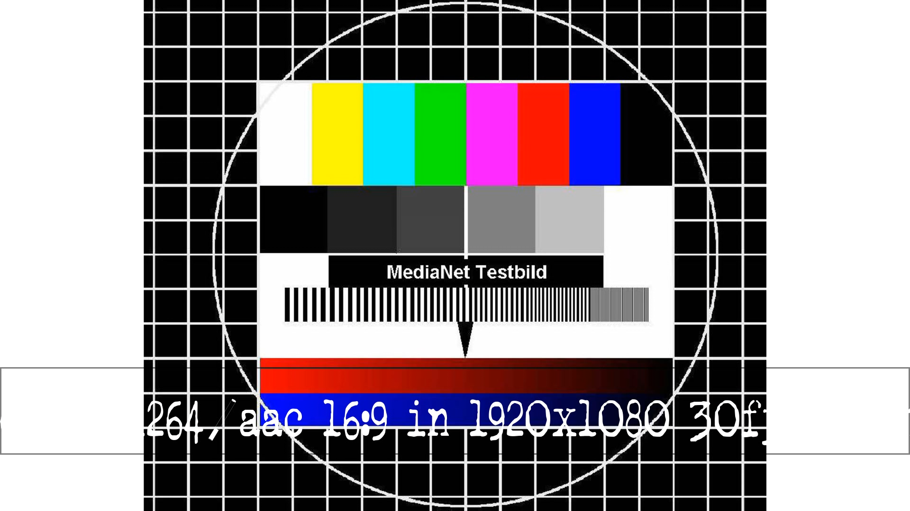
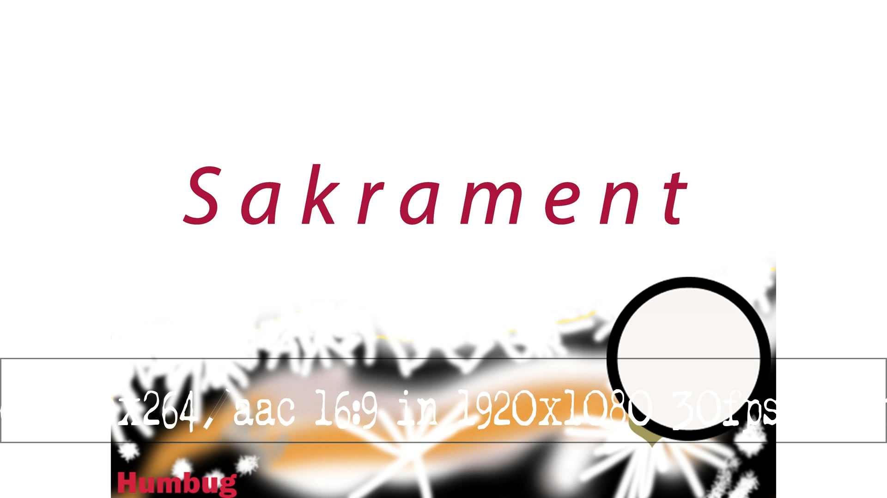
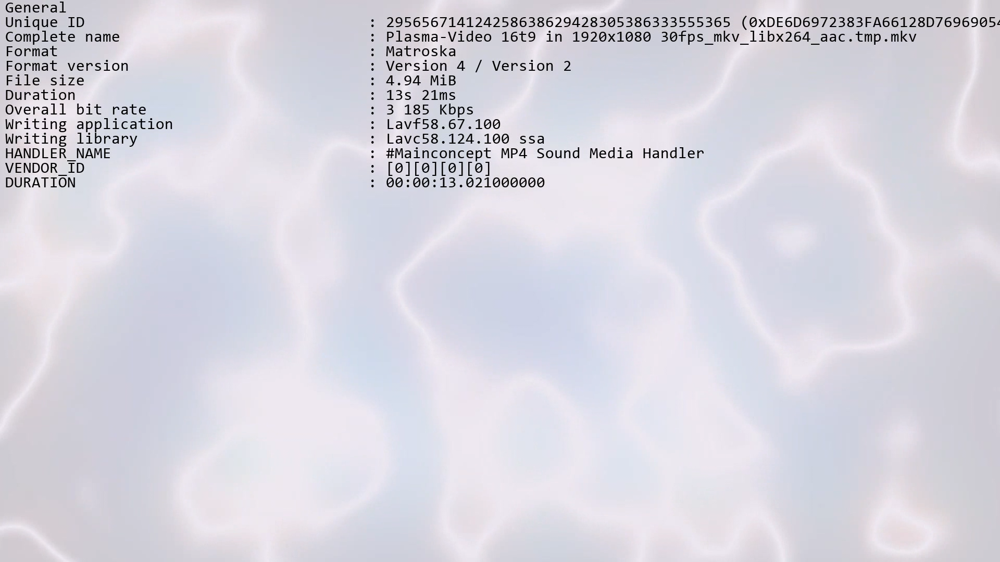
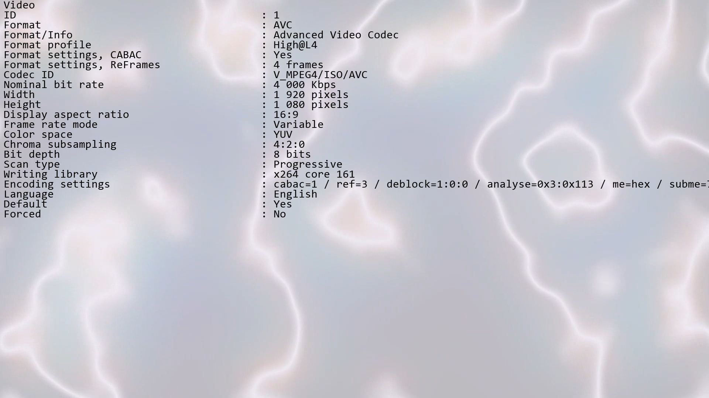
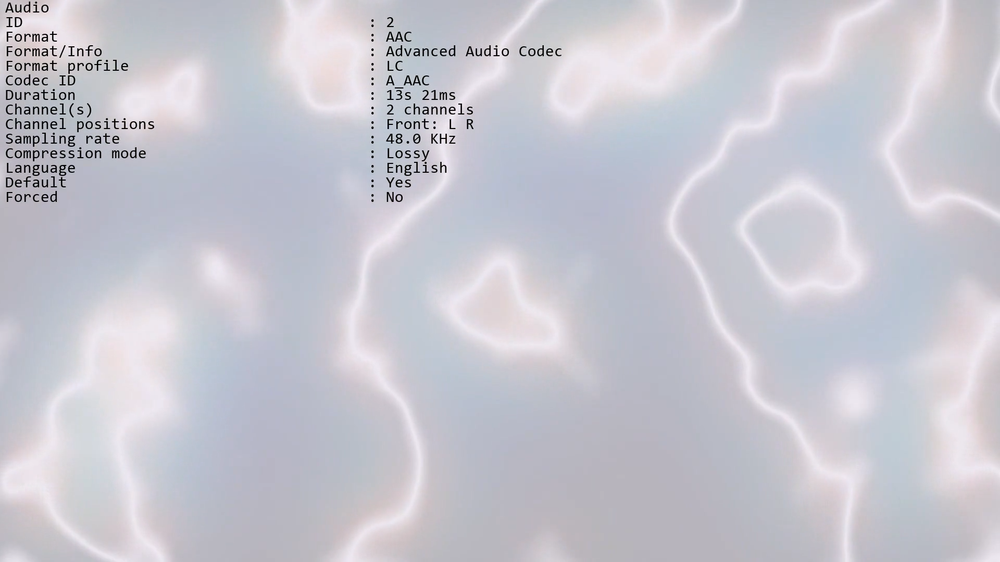
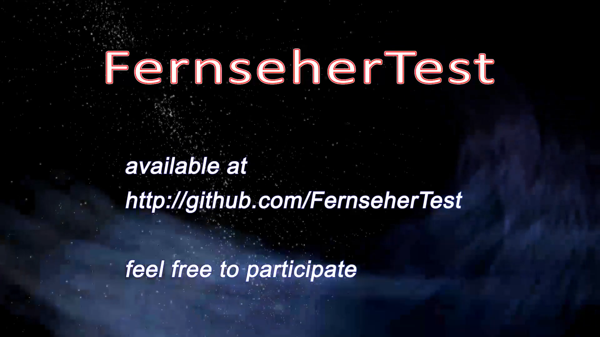
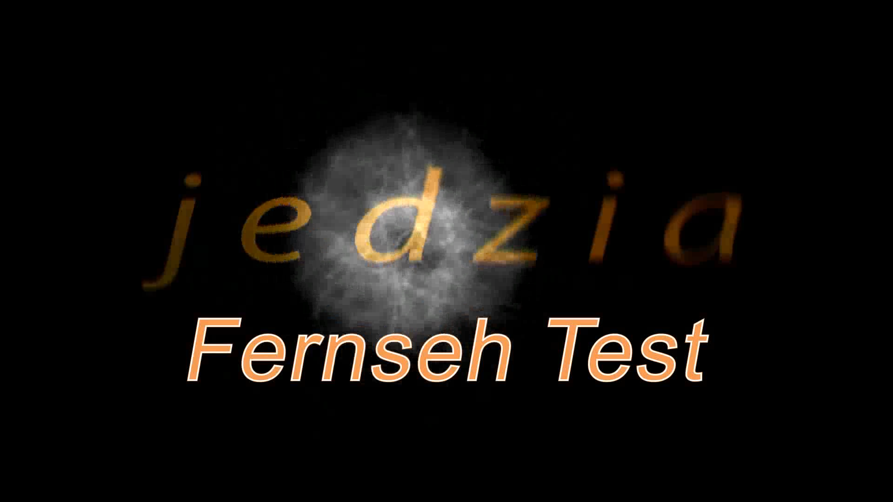

# FernseherTest #
... just a Testcard generator

With this little puppy you can do things like this:

| Cards             | Overlay               | Infos  |
| ----------------- | --------------------- | ------ |
|  |  |  |
| Pure Image overlays. Timing can be specified| Images combined with text, programmable (ffmpeg ftw) | Via shell-programs or text fetched informations. Including a video with informations about the **current** video in processing:) |

| Infos             | Infos                 | Infos  |
| ----------------- | --------------------- | ------ |
|  |  |  |
| About the video itself, that you know what you are watching/testing on screen | the same for audio | Intros/Outros, speaking any video can programmatically be an extension point |

----------------------------------------------------------------

### At all, this is looking like this: ###

## Disclaimer ##

-----------------------------------------------------------------

> description follows, excuse;)

> and instructions

At the moment the whole thing is directed against cooperation ... unusable for joint development? Simply because the documentation sucks and the whole part is in the development stage. Totally without a concept.
**Anyone who wants a free herring here can lick my ass.**
That's because I only need this part once a decade. So not the bum thing ... I mean the software.
But if someone is interested, we can of course bring everything up to speed.
**But**: swear word variables are beyond any discussion! 

## Instructions ##

Fuck me!

## Development notes ##
Source and deduction of the standard to use:
https://media.ccc.de/v/36c3-10652-bahnmining_-_punktlichkeit_ist_eine_zier#t=4

    General
    Complete name                            : E:\Downloads\36c3-10652-deu-eng-BahnMining_-_Puenktlichkeit_ist_eine_Zier_hd.mp4
    Format                                   : MPEG-4
    Format profile                           : Base Media
    Codec ID                                 : isom (isom/iso2/avc1/mp41)
    File size                                : 455 MiB
    Duration                                 : 1h 1mn
    Overall bit rate                         : 1 028 Kbps
    Movie name                               : BahnMining - Pünktlichkeit ist eine Zier
    Album                                    : 36th Chaos Communication Congress
    Performer                                : David Kriesel
    Genre                                    : lecture
    Description                              : Seit Anfang 2019 hat David <i>jeden</i> einzelnen Halt <i>jeder</i> einzelnen Zugfahrt auf <i>jedem</i> einzelnen Fernbahnhof in ganz Deutschland systematisch gespeichert. Inklusive Verspätungen und allem drum und dran. Und die werden wir in einem bunten Vortrag erforschen und endlich mal wieder ein bisschen Spaß mit Daten haben. /  / <i>Rechtlicher Hinweis: Es liegt eine schriftliche Genehmigung der Bahn vor, von ihr abgerufene Rohdaten aggregieren und für Vorträge nutzen zu dürfen. Inhaltliche Absprachen oder gar Auflagen existieren nicht.</i>
    Writing application                      : Lavf57.83.100
    Copyright                                : Licensed to the public under https://creativecommons.org/licenses/by/4.0/
    
    Video #1
    ID                                       : 1
    Format                                   : AVC
    Format/Info                              : Advanced Video Codec
    Format profile                           : High@L4.1
    Format settings, CABAC                   : Yes
    Format settings, ReFrames                : 4 frames
    Codec ID                                 : avc1
    Codec ID/Info                            : Advanced Video Coding
    Duration                                 : 1h 1mn
    Bit rate                                 : 522 Kbps
    Width                                    : 1 920 pixels
    Height                                   : 1 080 pixels
    Display aspect ratio                     : 16:9
    Frame rate mode                          : Constant
    Frame rate                               : 25.000 fps
    Color space                              : YUV
    Chroma subsampling                       : 4:2:0
    Bit depth                                : 8 bits
    Scan type                                : Progressive
    Bits/(Pixel*Frame)                       : 0.010
    Stream size                              : 231 MiB (51%)
    Writing library                          : x264 core 155 r2917 0a84d98
    Encoding settings                        : cabac=1 / ref=3 / deblock=1:0:0 / analyse=0x3:0x113 / me=hex / subme=7 / psy=1 / psy_rd=1.00:0.00 / mixed_ref=1 / me_range=16 / chroma_me=1 / trellis=1 / 8x8dct=1 / cqm=0 / deadzone=21,11 / fast_pskip=1 / chroma_qp_offset=-2 / threads=4 / lookahead_threads=1 / sliced_threads=0 / nr=0 / decimate=1 / interlaced=0 / bluray_compat=0 / constrained_intra=0 / bframes=3 / b_pyramid=2 / b_adapt=1 / b_bias=0 / direct=1 / weightb=1 / open_gop=0 / weightp=2 / keyint=250 / keyint_min=25 / scenecut=40 / intra_refresh=0 / rc_lookahead=40 / rc=crf / mbtree=1 / crf=23.0 / qcomp=0.60 / qpmin=0 / qpmax=69 / qpstep=4 / ip_ratio=1.40 / aq=1:1.00
    
    Video #2
    ID                                       : 2
    Format                                   : AVC
    Format/Info                              : Advanced Video Codec
    Format profile                           : High@L4.1
    Format settings, CABAC                   : Yes
    Format settings, ReFrames                : 4 frames
    Codec ID                                 : avc1
    Codec ID/Info                            : Advanced Video Coding
    Duration                                 : 1h 1mn
    Bit rate                                 : 238 Kbps
    Width                                    : 1 920 pixels
    Height                                   : 1 080 pixels
    Display aspect ratio                     : 16:9
    Frame rate mode                          : Constant
    Frame rate                               : 25.000 fps
    Color space                              : YUV
    Chroma subsampling                       : 4:2:0
    Bit depth                                : 8 bits
    Scan type                                : Progressive
    Bits/(Pixel*Frame)                       : 0.005
    Stream size                              : 105 MiB (23%)
    Writing library                          : x264 core 155 r2917 0a84d98
    Encoding settings                        : cabac=1 / ref=3 / deblock=1:-3:-3 / analyse=0x3:0x113 / me=hex / subme=7 / psy=1 / psy_rd=2.00:0.70 / mixed_ref=1 / me_range=16 / chroma_me=1 / trellis=1 / 8x8dct=1 / cqm=0 / deadzone=21,11 / fast_pskip=1 / chroma_qp_offset=-4 / threads=4 / lookahead_threads=1 / sliced_threads=0 / nr=0 / decimate=1 / interlaced=0 / bluray_compat=0 / constrained_intra=0 / bframes=3 / b_pyramid=2 / b_adapt=1 / b_bias=0 / direct=1 / weightb=1 / open_gop=0 / weightp=2 / keyint=250 / keyint_min=25 / scenecut=40 / intra_refresh=0 / rc_lookahead=40 / rc=crf / mbtree=1 / crf=23.0 / qcomp=0.60 / qpmin=0 / qpmax=69 / qpstep=4 / ip_ratio=1.40 / aq=1:1.20
    Default                                  : No
    
    Audio #1
    ID                                       : 3
    Format                                   : AAC
    Format/Info                              : Advanced Audio Codec
    Format profile                           : LC
    Codec ID                                 : 40
    Duration                                 : 1h 1mn
    Duration_LastFrame                       : -15ms
    Bit rate mode                            : Constant
    Bit rate                                 : 128 Kbps
    Channel(s)                               : 2 channels
    Channel positions                        : Front: L R
    Sampling rate                            : 48.0 KHz
    Frame rate                               : 46.875 fps (1024 spf)
    Compression mode                         : Lossy
    Stream size                              : 56.5 MiB (12%)
    Language                                 : German
    Default                                  : Yes
    Alternate group                          : 1
    
    Audio #2
    ID                                       : 4
    Format                                   : AAC
    Format/Info                              : Advanced Audio Codec
    Format profile                           : LC
    Codec ID                                 : 40
    Duration                                 : 1h 1mn
    Duration_LastFrame                       : -15ms
    Bit rate mode                            : Constant
    Bit rate                                 : 128 Kbps
    Channel(s)                               : 2 channels
    Channel positions                        : Front: L R
    Sampling rate                            : 48.0 KHz
    Frame rate                               : 46.875 fps (1024 spf)
    Compression mode                         : Lossy
    Stream size                              : 56.6 MiB (12%)
    Language                                 : English
    Default                                  : No
    Alternate group                          : 1
     